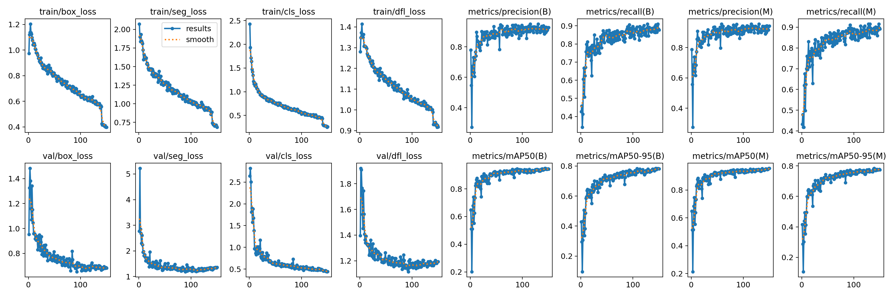

# Instance Segmentation – Training Results

This repository contains the trained instance segmentation model and its evaluation results.

## Dataset
- **Images:** 200  
- **Instances:** 213  
- **Split:** Train / Validation

## Training
- **Epochs:** 150  
- Training and validation losses (box, seg, cls, dfl) decrease smoothly and plateau, indicating convergence.

## Performance Summary
- **Box mAP@50:** ~0.92–0.94  
- **Box mAP@50–95:** ~0.75–0.78  
- **Mask mAP@50:** ~0.93–0.95  
- **Mask mAP@50–95:** ~0.76–0.77  

The model achieves high accuracy at standard IoU thresholds and remains robust at stricter IoUs.

## Precision & Recall
From the confusion matrix:
- **True Positives:** 194  
- **False Positives:** 29  
- **False Negatives:** 19  

**Precision:** ~0.87  
**Recall:** ~0.91  
**F1-score:** ~0.89  

The model favors high precision while maintaining strong recall.

## Visual Results
Training curves, metrics, and confusion matrix:

## Notes
- Few false positives on background.
- Some missed detections likely from small or low-contrast objects.
- Boundary accuracy can be improved further (mAP@50–95 gap).

---
